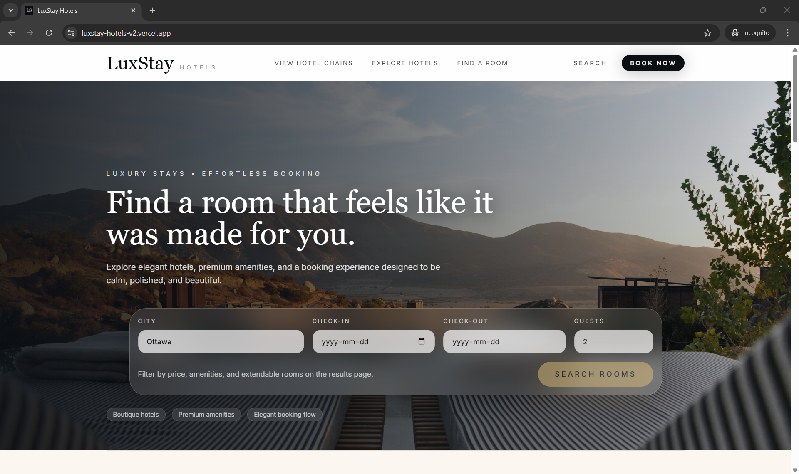
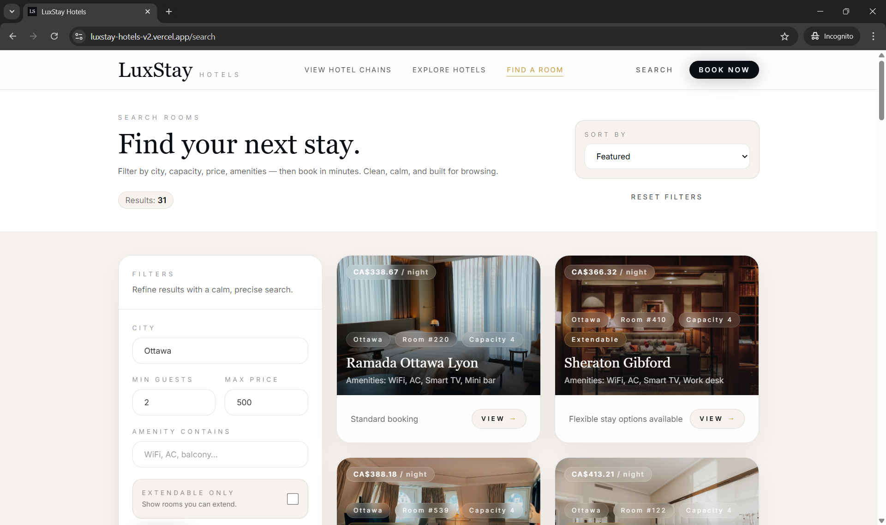
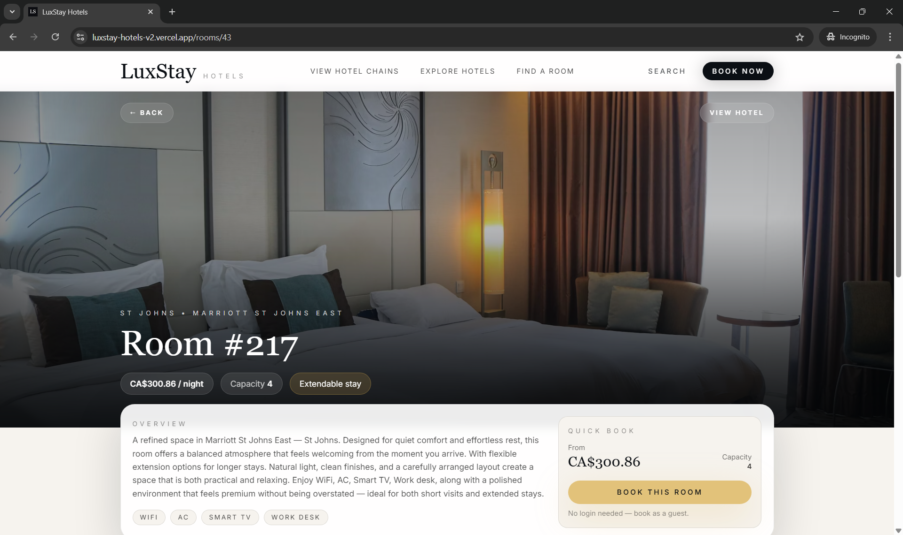
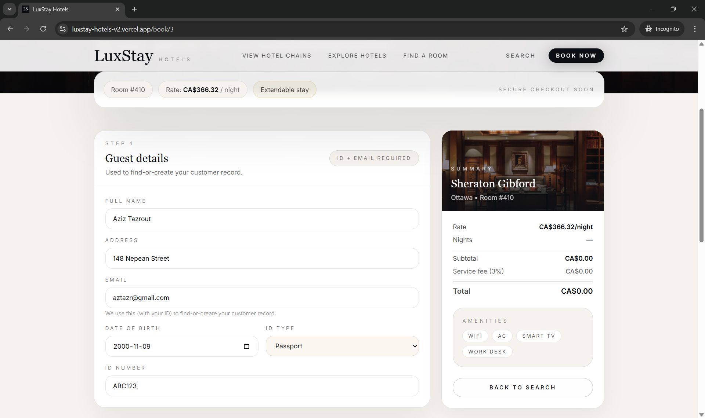
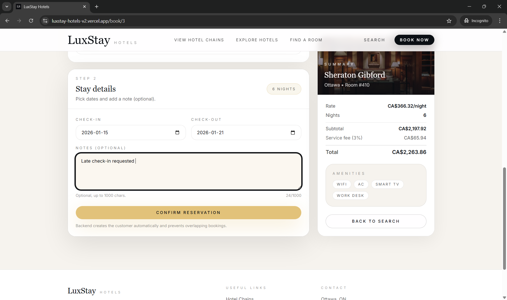
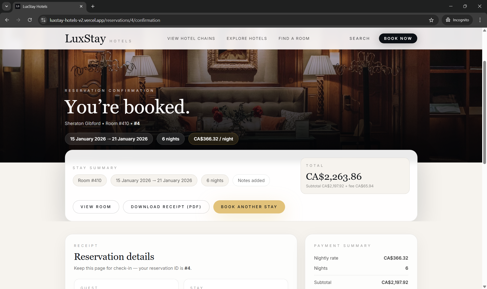

# 🏨 LuxStay Hotels (v2)

✨ **LuxStay Hotels** is a full-stack, **multi-chain hotel management & booking platform** built with **Spring Boot + React**.  
It models real hotel operations (chains → hotels → rooms → reservations) with a strong focus on **data integrity**, **scalable domain design**, and a polished, **SaaS-style** browsing & booking experience.

🔗 **Live Demo:** https://luxury-hotel-hazel.vercel.app/  
🔗 **Backend API:** https://luxury-hotel-11zt.onrender.com/

---

## 📸 Screenshots

### 🏨 Landing Page
> First impression focused on clarity, calm visuals, and a premium booking experience.



---

### 🔍 Search & Filter Rooms
> Browse rooms with real-time filtering by city, capacity, price, amenities, and extendable stays.



---

### 🛏️ Room Details
> Detailed room view with pricing, amenities, and a fast guest booking entry point.



---

### 🧾 Booking — Guest Details
> Step 1 of the booking flow. Customer is identified using ID + email (find-or-create logic).



---

### 📅 Booking — Stay Details
> Step 2 of the booking flow with live pricing, date validation, and overlap prevention.



---

### ✅ Reservation Confirmation
> Successful booking confirmation with stay summary and receipt-style layout.




---

## 🚀 What you can do

### 🌐 Public experience (browsing + booking)
- Browse rooms in a **luxury-style UI** with clean typography and responsive layouts
- Filter rooms by **city**, **capacity**, **max price**, **amenities**, and **extendable-only**
- Sort results (Featured, Price ↑/↓, Capacity ↓)
- Book a room with a guided **two-step checkout**:
  1. **Guest details** (ID + email used to find-or-create a customer profile)
  2. **Stay details** (check-in / check-out + optional notes)
- Receive clear, user-friendly errors when a room is already booked (`409 CONFLICT`)

### 🏢 Platform capabilities (multi-chain domain)
- Manage **multiple hotel chains**
- Each chain contains **multiple hotels**
- Each hotel manages its own **rooms, pricing, and reservations**
- Designed as a strong foundation for a **commercial booking platform / PMS**

---

## 🧭 User Journey (end-to-end)

1. 🏙️ User browses hotel chains and hotels  
2. 🔍 Searches rooms using filters & sorting  
3. 🛏️ Views room details  
4. ✍️ Books a room (guest info → dates)  
5. ✅ Reservation is validated, stored, and confirmed  

This mirrors how real booking platforms guide users with minimal friction.

---

## 💡 Highlights (engineering)

### 🔐 Reservation integrity (availability engine)
LuxStay enforces booking correctness using a canonical overlap rule:

> Reservations are treated as **[startDate, endDate)** (end date is exclusive).  
> Two ranges overlap if: `reqStart < existingEnd && reqEnd > existingStart`

Enforced through:
- Overlap checks that **ignore CANCELLED** reservations
- Update-safe conflict checks via `excludeReservationId`
- Detailed `409 CONFLICT` messages explaining the earliest conflicting booking window

### 📏 Real-world business rules
- ❌ No room/date changes after check-in
- ❌ Cannot cancel after check-in
- 🔁 Idempotent payment behavior (`pay` is safe to re-trigger)
- 🧠 Automatic customer deduplication (email + ID number)

### 🗄️ Database-level safeguards
- DB `CHECK` constraints for valid reservation & payment status
- Indexes optimized for real query patterns:
  - customer lookup (`customer_id`)
  - room-date queries (`room_id,start_date,end_date`)
- Unique constraint: room numbers are unique **per hotel**, not globally  
  `(hotel_id, room_number)`

### ⚡ Frontend UX & performance
- **Session cache with TTL** for fast revisits (instant paint, fewer network calls)
- Skeleton loaders + calm empty states
- Centralized API client:
  - Base URL normalization
  - Safe JSON parsing by content-type
  - Consistent error propagation
  - AbortController support for cancellation-ready flows

---

## 🧠 Key Design Decisions

- 🧱 **Multi-chain architecture from day one** (no retrofitting)
- 📅 **End-exclusive date modeling** to eliminate edge-case overlaps
- 🛡️ **Data integrity enforced at both service & database levels**
- 🔌 **Frontend–backend contract stability** via DTOs and versioned APIs
- 🎨 **UX-first approach** while maintaining strict backend rules

---

## 🛠️ Tech Stack

### ⚙️ Backend
- Java 21, Spring Boot 3
- Spring Data JPA (Hibernate)
- DTO validation + clean layering (domain / service / repo / web)
- REST API (versioned under `/api/v2`)
- Global error handling with **Problem Details** (RFC 7807)
- Production-ready CORS configuration

### 🎨 Frontend
- React (Vite)
- Tailwind CSS
- Component-based UI primitives (Card / Button / Input)
- Centralized API module (endpoint map + fetch wrapper)

### 🗃️ Database
- PostgreSQL (Neon)
- Relational modeling for chains / hotels / rooms / reservations
- Constraints + indexes to enforce integrity

### ☁️ Deployment
- Backend: Render
- Frontend: Vercel
- Database: Neon
- Environment-based configuration (dev / prod)

---

## 🔌 API Overview (selected)

Base path: `/api/v2`

- `GET /chains`
- `GET /hotels`
- `GET /rooms`
- `POST /reservations` — create booking
- `GET /reservations` — filter by room/customer/status/payment/date range
- `PUT /reservations/{id}` — controlled update
- `POST /reservations/{id}/cancel`
- `POST /reservations/{id}/pay`
- `DELETE /reservations/{id}`

---

## 🧑‍💻 Local Setup

### 1️⃣ Backend (Spring Boot)
From `backend/`:

```bash
./mvnw spring-boot:run
```

Environment variables:
- `SPRING_DATASOURCE_URL`
- `SPRING_DATASOURCE_USERNAME`
- `SPRING_DATASOURCE_PASSWORD`
- `frontend.url` (for CORS)

Backend runs on: `http://localhost:8080`

### 2️⃣ Frontend (React)
From `frontend/`:

```bash
npm install
npm run dev
```

Create `frontend/.env`:

```bash
VITE_API_BASE_URL=http://localhost:8080
```

Frontend runs on: `http://localhost:5173`

---

## 📁 Project Structure

```
luxstay-hotels-v2/
  backend/   # Spring Boot API (domain/service/repo/web)
  frontend/  # React + Tailwind UI
```

---

## 🧭 Roadmap Ideas
- Admin dashboard for chain/hotel/room management & analytics
- Availability search backed by date-range queries
- Rate plans / seasonal pricing
- Inventory rules (minimum stay, blackout dates)
- Automated tests (service & repository overlap cases)

---

## 📄 License

This project is proprietary and protected under an **All Rights Reserved** license.

The source code is provided for **viewing and evaluation purposes only** as part of a personal portfolio.  
Any use, reproduction, modification, or distribution without explicit permission from the author is prohibited.
